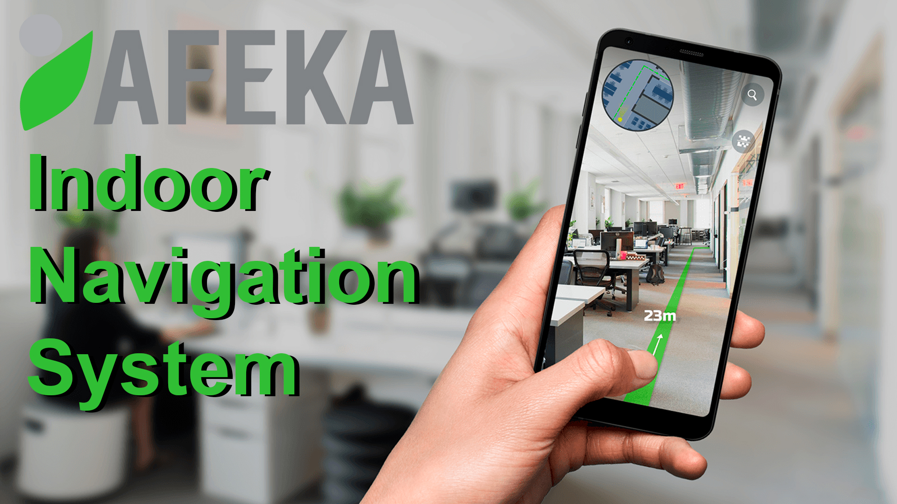

<!-- PROJECT LOGO -->
 

  

  <h3 align="center">Indoor Navigation System</h3>

  

    Afeka's College of Engineering Graduation Project
     
    <a href="https://github.com/vladuha12/IndoorNavigationSystem"><strong>Explore the repository »</strong></a>
     
     
    <a href="https://www.youtube.com/watch?v=oCg1ogz9MWs">YouTube demonstration video</a>
  

<!-- TABLE OF CONTENTS -->

  
Table of Contents

  <ol>
    <li>
      <a href="#about-the-project">About The Project</a>
      <ul>
        <li><a href="#built-with">Built With</a></li>
      </ul>
    </li>
    <li><a href="#conclusions">Conclusions</a></li>
    <li><a href="#future-development">Future development</a></li>
    <li><a href="#contact">Contact</a></li>
  </ol>

<!-- ABOUT THE PROJECT -->
## About The Project
The Indoor navigation System's purpose is to scan, recognize and calculate a route to the destination target within a closed environment. It is not just about finding the right location; our system will guide you through the shortest routes possible and ensure you reach your destination without hurdles. Today, regular navigation applications are used for navigating on public roads. This is due to the high complexity and the precision requirements necessary to implement such systems within buildings.

Our mobile application will provide a solution to this widespread problem. The application will use the phone's camera to scan your surroundings and draw guidance lines on the screen pointing to the destination. That approach has some challenges which should be solved, including low computation power of mobile devices, high battery demand, different obstacles on the recognition path and a lot more different challenges that we encountered during development of the desired system.

To meet the requirements, the solution has been developed as a cascade of three phases: modeling, in which the entire closed environment is modeled, and target points are added. Next, in the tracking phase, the environment is tracked frame by frame, until it contains enough appropriate tracking information, which is then used for the last phase, the route calculation and visual application, in the route calculation phase.

In conclusion, the project offers an efficient and effective solution for the indoor navigation problem, with a high potential for implementation in low-resource environments such as smart phones, which makes the necessity of purchasing and installing additional tracking devices redundant. Furthermore, the modular design and implementation of the project makes it easier to be extended and improved, both in performance and in functionality, to eventually be used daily.

(<a href="#top">back to top</a>)

### Built With

* [Unity 3D](https://unity.com/learn)
* [zxing](https://github.com/zxing/zxing)
* [Unity AR Foundation](https://docs.unity3d.com/Packages/com.unity.xr.arfoundation@5.0/manual/index.html)
* [Unity ARFoundation Scripting API for ARSession](https://docs.unity3d.com/Packages/com.unity.xr.arfoundation@4.2/api/UnityEngine.XR.ARFoundation.ARSession.html)
* [Unity Graphics.Blit()](https://docs.unity3d.com/ScriptReference/Graphics.Blit.html)

(<a href="#top">back to top</a>)

<!-- CONCLUSIONS -->
## Conclusions

AR navigation: Finding our way into the future
Because of these technological improvements, AR navigation technology is set to
experience tremendous growth. Business owners, project managers, face a lot of challenges when looking to implement AR navigation solutions into their businesses. However, understanding the possible use cases and technologies can be useful for determining ways in which AR navigation can integrate with existing systems and meet the needs of businesses and consumers. AR navigation is a fast-growing market and remaining competitive is important for success.

Using AR navigation to help consumers find the products they need in a large supermarket or to help workers find specific items in large warehouses can be a gamechanger in improving sales and workplace efficiency. This technology also stands to improve overall customer and employee experience satisfaction. Taken together, AR navigation indoors and outdoors can improve the overall performance of a business.
Future development 
The facts mentioned above show that our model can be integrated into different businesses. But, to achieve this, every business is required to model the entire building plan. There are various implementations of 3D scanning hardware but there is none of them using mobile phones. If we could integrate the scanning and auto-modeling mechanics into our application, it could make the navigation experience accessible on larger scales and ease the development.

(<a href="#top">back to top</a>)

<!-- Future-development -->
## Future development

Here are some additional ideas for future developments:
* Adding multiple floor navigation. 
* Map rotation based on the movement direction.
* Additional AR objects integration (hints, information stands etc.).
* iOS support

(<a href="#top">back to top</a>)

<!-- CONTACT -->
## Contact

Vlad Chebanov: - [LinkedIn](https://www.linkedin.com/in/vlad-chebanov-69b130137/) - vlad.chebanov@gmail.com

Amir Litan: - [LinkedIn](https://www.linkedin.com/in/amir-litan-443860191/) - amirlitan@gmail.com

Project Link: [https://github.com/vladuha12/IndoorNavigationSystem](https://github.com/vladuha12/IndoorNavigationSystem)

(<a href="#top">back to top</a>)

